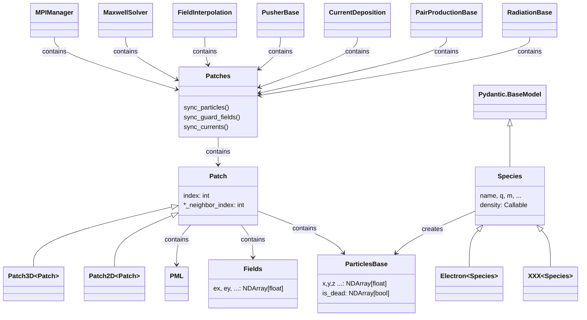

# Introduction

λPIC is a callback-centric Particle-In-Cell framework.
It enables the customization of simulation behavior through callbacks at various stages, even when the modifications are unphysical.
The flexibility of λPIC makes it easy to implement plugins, allowing developers to extend functionality seamlessly without modifying the core simulation logic.

Visit the [documentation](https://lambdapic.readthedocs.io/) for installation and usage instructions.

## Core Classes

## Contributing

Contributions are welcome! Please feel free to submit a Pull Request.

## Development Status

λPIC is currently in active development. The API may change without notice.

## License

This project is licensed under the GPL-3.0 License.

## Acknowledgments

This work was supported by the National Natural Science Foundation of China (NSFC) under Grant No. 12304384.

This project was inspired by and adapted elements from the [EPOCH](https://github.com/Warwick-Plasma/epoch) and the [Smilei](https://github.com/SmileiPIC/Smilei) projects.