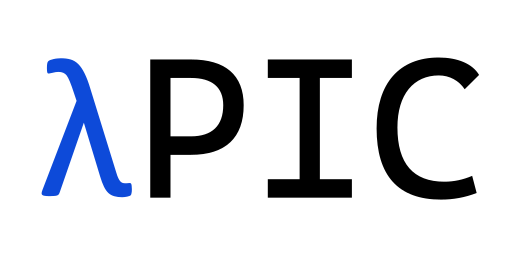

# Introduction
<div style="text-align:center;">


</div>
λPIC is a callback-centric Particle-In-Cell framework.
It enables the customization of simulation behavior through callbacks at various stages, even when the modifications are unphysical.
The flexibility of λPIC makes it easy to implement plugins, allowing developers to extend functionality seamlessly without modifying the core simulation logic.

## Features

- Callback-centric simulation loop
  - Diagnostics & outputs
  - Modifying simulation at runtime
- Patch-based domain decomposition 
  - Load balancing via [METIS](https://github.com/KarypisLab/METIS)
- Fast particle deletion with `is_dead` flag
- Providing particle-in-cell library via `lambdapic.core`
  - High-level via Python
  - Low-level kernels in C/Numba
- Common functionalities
  - MPI + OpenMP
  - PML boundary
  - Photon emission & pair production
  - [ ] Collision
  - [ ] Nuclear physics
  - [ ] GPU acceleration

## Installation

1. install prebuilt packages from conda like mpi4py, h5py (which are not easy to build).
    ```bash
    conda create -n lambdapic mpi4py h5py numpy scipy
    conda activate lambdapic
    ```
2. install lambdapic via pip
    ```bash
    pip install lambdapic
    ```

    or from source
    ```bash
    git clone https://github.com/xsgeng/lambdapic.git
    cd lambdapic
    pip install .
    ```

    building from source requires GCC >= 9.3 (from numpy)


## Callback System

Simulation loop stages:

- `start`: Beginning of each timestep
- `maxwell first`: First half of Maxwell solver
- `push position first`: First particle position update
- `interpolator`: Field interpolation
- `push momentum`: Particle momentum update
- `push position second`: Second particle position update
- `current deposition`: Current deposition
- `maxwell second`: Second half of Maxwell solver

Each callback can be attached to any of these stages using the `@callback` decorator.

```python
# laser injector is pre-defined callback
laser = SimpleLaser(
    a0=10,
    w0=5e-6,
    ctau=5e-6
)

# Custom callbacks
@callback()
def energy_sum(sim):
    if sim.itime % 100 != 0:
        return

    total_energy = 0
    for patch in sim.patches:
        # Calculate electromagnetic energy
        ex = patch.fields.ex
        ey = patch.fields.ey
        bz = patch.fields.bz
        energy = 0.5 * (ex**2 + ey**2 + bz**2).sum()
        total_energy += energy
    print(f"Total EM energy: {total_energy}")

@callback(stage="maxwell first")
def mod_ex(sim):
    # Modify fields during the Maxwell solver stage
    for patch in sim.patches:
        patch.fields.ex *= 1.1  # Amplify Ex field by 10%

# Run simulation with callback
sim.run(
    nsteps=1000, 
    callbacks=[
        laser,
        energy_sum,
        mod_ex, 
        callback(stage="start")(lambda sim: print(f"timestep @ {sim.itime} starts")),
        lambda sim: print(f"timestep @ {sim.itime} ends")
    ]
)
```

## Core Classes


## Contributing

Contributions are welcome! Please feel free to submit a Pull Request. For major changes, please open an issue first to discuss what you would like to change.

## Development Status

λPIC is currently in active development. The API may change without notice.

## License

This project is licensed under the GPL-3.0 License.

## Acknowledgments

This work was supported by the National Natural Science Foundation of China (NSFC) under Grant No. 12304384.

This project was inspired by and adapted elements from the [EPOCH](https://github.com/Warwick-Plasma/epoch) and the [Smilei](https://github.com/SmileiPIC/Smilei) projects.