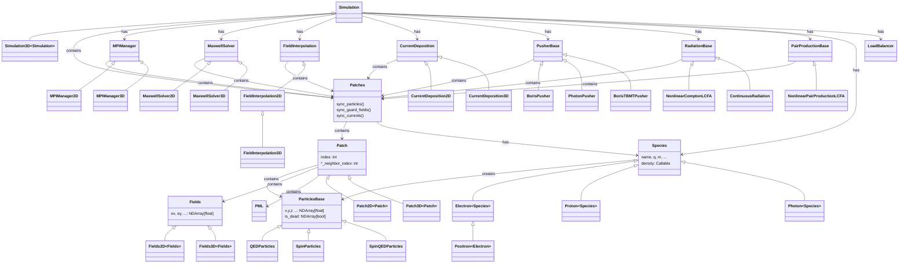

# Core Classes

The following diagram shows the main classes in λPIC and their relationships.

## Overview

- **Simulation** orchestrates the entire simulation loop and owns all major components.
- **Patches** is a collection of **Patch** instances, each holding local **Fields** and **ParticlesBase**.
- **Species** defines particle properties and creates **ParticlesBase** instances.
- Solver classes (e.g. **MaxwellSolver**, **CurrentDeposition**, **PusherBase**) operate on **Patches**.
